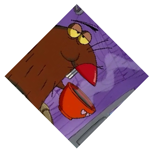

# Transform

Rotate, Scale, Shear and Translate [`draw.Image`](https://godoc.org/image/draw#Image)s.

| Function | Output |
| --- | --- |
| Original |  |
| `transform.Rotate(img, 45)` |  |
| `transform.Rotate(img, 90)` |  |
| `transform.Shear(img, 1.25, 0)`|  |
| `transform.Translate(img, 150, 150)`|  |
| `transform.Scale(img, 0.75, 0.75)` |  |
| `transform.Scale(img, 1.5, 1.5)` `transform.Rotate(img, 45)` |  |
| `transform.MirrorX(img)` |  |
| `transform.MirrorY(img)` |  |
